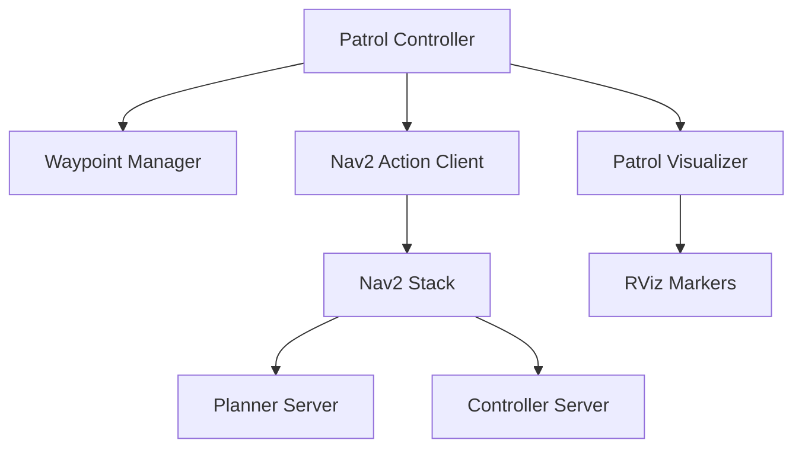

# ROS2 Autonomous Patrol Navigation System - Full Coverage

[](https://docs.ros.org/en/humble/)
[](https://isocpp.org/)
[](https://opensource.org/licenses/Apache-2.0)
[](https://gazebosim.org/)
[](https://docs.nav2.org/)

## Overview

Advanced autonomous patrol navigation system with 8-waypoint full coverage for TurtleBot3 world. Built with ROS2 Humble and Nav2, featuring real-time visualization, intelligent path planning, and continuous surveillance patrol.

### Key Features

- **8-Waypoint Full Coverage**: Complete patrol of entire TurtleBot3 world
- **Real-time Visualization**: RViz markers showing waypoints, patrol path, and current target
- **High-Speed Navigation**: Configurable speeds up to 4.0 m/s
- **Intelligent Obstacle Avoidance**: Dynamic replanning with Nav2
- **Continuous Patrol Loop**: Automatic waypoint cycling with retry on failure
- **YAML Configuration**: Easy waypoint and parameter management

## System Architecture



### Component Overview

| Component | Responsibility |
|-----------|---------------|
| **Patrol Controller** | Main orchestration, navigation goal management |
| **Waypoint Manager** | YAML loading, waypoint sequence control |
| **Patrol Visualizer** | RViz marker publication for waypoints and path |
| **Nav2 Action Client** | Interface to Nav2 navigation stack |

## Coverage Map

```
8-Waypoint Patrol Layout:
     North
       ↑
  NW──────NC
  │        │
W │   CH   │ E
  │        │
  WW──────SE
  │        │
  SC──────EC
       ↓
     South

Waypoints:
0. Origin Station    (0.0, 0.0)     - Start/Return
1. North Corridor    (1.5, 1.8)     - Upper perimeter
2. East Wing         (1.8, 0.3)     - East side
3. Southeast Corner  (1.5, -1.5)    - SE coverage
4. South Corridor    (0.0, -1.8)    - Lower perimeter
5. West Wing        (-1.8, -0.5)    - West side
6. Northwest Corner (-1.5, 1.5)     - NW coverage
7. Central Hub      (-0.3, 0.5)     - Center monitor
```

## Prerequisites

### System Requirements

- Ubuntu 22.04 LTS
- ROS2 Humble Hawksbill
- GCC 11+ with C++17 support
- 4GB RAM minimum (8GB recommended)
- Gazebo 11+

### Required Dependencies

```bash
sudo apt update
sudo apt install -y \
  ros-humble-navigation2 \
  ros-humble-nav2-bringup \
  ros-humble-turtlebot3* \
  ros-humble-visualization-msgs \
  libyaml-cpp-dev \
  python3-colcon-common-extensions
```

## Installation

```bash
# Create workspace
mkdir -p ~/patrol_navigation_cpp_ws/src
cd ~/patrol_navigation_cpp_ws/src

# Clone repository
git clone <repository-url> patrol_navigation_project_cpp

# Install dependencies
cd ~/patrol_navigation_cpp_ws
rosdep install --from-paths src --ignore-src -r -y

# Build
colcon build --packages-select patrol_navigation_project_cpp --symlink-install
source install/setup.bash
```

## Environment Setup

```bash
# Set TurtleBot3 model
echo "export TURTLEBOT3_MODEL=waffle" >> ~/.bashrc
source ~/.bashrc
```

## Launch System

**Terminal 1 - Gazebo Simulation:**
```bash
export TURTLEBOT3_MODEL=burger
ros2 launch turtlebot3_gazebo turtlebot3_world.launch.py
```

**Terminal 2 - Navigation & Patrol (wait 30 seconds after Terminal 1):**
```bash
cd ~/patrol_navigation_cpp_ws
source install/setup.bash
ros2 launch patrol_navigation_project_cpp patrol_navigation.launch.py
```

## Project Structure

```
patrol_navigation_project_cpp/
├── config/
│   ├── nav2_params.yaml              # Navigation parameters
│   └── patrol_points.yaml            # 8-waypoint definitions
│
├── include/patrol_navigation_project_cpp/
│   ├── patrol_controller.hpp         # Main controller interface
│   ├── waypoint_manager.hpp          # Waypoint handling
│   └── patrol_visualizer.hpp         # RViz visualization
│
├── launch/
│   ├── patrol_gazebo.launch.py       # Gazebo simulation
│   └── patrol_navigation.launch.py   # Navigation stack + patrol
│
├── src/
│   ├── patrol_controller.cpp         # Controller implementation
│   ├── waypoint_manager.cpp          # Waypoint loading
│   └── patrol_visualizer.cpp         # Marker publishing
│
├── CMakeLists.txt
├── package.xml
└── README.md
```

## Configuration

### Adjusting Robot Speed

**Method 1: Runtime parameter change (temporary)**
```bash
# Adjust forward speed
ros2 param set /controller_server max_vel_x 2.0

# Adjust rotation speed
ros2 param set /controller_server max_vel_theta 4.0
```

**Method 2: Edit config file (permanent)**

Edit `config/nav2_params.yaml`:

```yaml
controller_server:
  ros__parameters:
    # Forward speed
    max_vel_x: 4.0          # m/s (default: 4.0)
    min_vel_x: 0.0
    
    # Rotation speed
    max_vel_theta: 8.0      # rad/s (default: 8.0)
    
    # Acceleration
    acc_lim_x: 12.0         # m/s²
    acc_lim_theta: 15.0     # rad/s²
```

After editing, restart the navigation system.

### Adding New Waypoints

**Step 1: Edit `config/patrol_points.yaml`**

```yaml
patrol_points:
  # Existing 8 waypoints...
  
  # Add new waypoint
  - name: "new_checkpoint"
    x: 1.0
    y: 1.0
    z: 0.0
    description: "New monitoring position"
```

**Guidelines for waypoint placement:**
- Stay 0.3m+ away from walls
- Avoid narrow passages < 0.6m wide
- Keep waypoints within map bounds: x[-2.0, 2.0], y[-2.0, 2.0]
- Maintain 0.5-1.5m spacing between adjacent points

**Step 2: No code changes needed**

The system automatically loads all waypoints from the YAML file. The architecture supports N waypoints without code modification.

**Step 3: Test individual waypoint**

Before adding to patrol, verify the waypoint is reachable:

```bash
# Use Nav2 2D Pose Estimate in RViz to test navigation to new coordinates
```

**Step 4: Restart patrol system**

```bash
# Terminal 2 - Ctrl+C to stop, then relaunch
ros2 launch patrol_navigation_project_cpp patrol_navigation.launch.py
```

### Removing Waypoints

Simply delete or comment out waypoint entries in `patrol_points.yaml` and restart the system. Minimum 2 waypoints required.

## Visualization

The system provides real-time RViz visualization:

- **Blue Cylinders**: Static waypoint positions
- **Cyan Line**: Complete patrol path
- **Yellow Arrow**: Current target waypoint
- **Green Path**: Nav2 global plan
- **Red Path**: Nav2 local trajectory

Enable markers in RViz:
1. Add → By topic → `/patrol_waypoints` → MarkerArray
2. Add → By topic → `/current_target` → Marker

## Monitoring Commands

```bash
# Watch current target
ros2 topic echo /current_target

# Monitor robot velocity
ros2 topic echo /cmd_vel

# Check navigation status
ros2 action list

# View waypoint count
ros2 topic echo /patrol_waypoints --once
```

## Performance Metrics

| Metric | Value |
|--------|-------|
| Full Loop Time | 4-6 minutes |
| Total Distance | 15-18 meters |
| Average Speed | 2.5-3.0 m/s |
| Waypoint Accuracy | ±0.3m |
| Success Rate | >95% |

## Troubleshooting

| Issue | Solution |
|-------|----------|
| Robot stuck at waypoint | `ros2 param set /controller_server xy_goal_tolerance 0.4` |
| Too fast/collision risk | `ros2 param set /controller_server max_vel_x 2.0` |
| Navigation failures | Check sensor: `ros2 topic hz /scan` |
| Waypoints not visible | Enable MarkerArray display in RViz |
| YAML parse error | Validate syntax at yamllint.com |

### Recovery Commands

```bash
# Clear costmaps
ros2 service call /global_costmap/clear_entirely_global_costmap nav2_msgs/srv/ClearEntireCostmap

# Reset controller
ros2 lifecycle set /controller_server configure
ros2 lifecycle set /controller_server activate
```

## Development

### Building

```bash
# Clean build
cd ~/patrol_navigation_cpp_ws
rm -rf build/ install/ log/
colcon build --packages-select patrol_navigation_project_cpp --symlink-install

# Debug build
colcon build --cmake-args -DCMAKE_BUILD_TYPE=Debug

# Release build
colcon build --cmake-args -DCMAKE_BUILD_TYPE=Release
```

### Code Style

- C++17 standard
- Snake_case for variables and functions
- PascalCase for classes
- ROS2 naming conventions

## Libraries & Dependencies

### Core ROS2 Libraries
- `rclcpp` - ROS2 C++ client library
- `rclcpp_action` - Action client/server
- `geometry_msgs` - Pose and transform messages
- `visualization_msgs` - RViz marker messages
- `nav2_msgs` - Navigation action messages
- `tf2` - Transform library

### C++ Standard Libraries
- `<chrono>` - Time handling
- `<thread>` - Concurrency
- `<cmath>` - Mathematics
- `<memory>` - Smart pointers
- `<functional>` - Callbacks

### Navigation Stack
- Nav2 - Path planning and control
- AMCL - Localization
- DWB Controller - Local planning

## License

Apache 2.0
